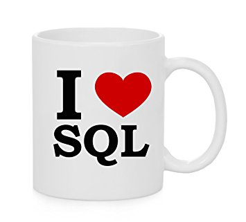

<!-- footer: Giorgos Komninos https://zendrom.com -->

Introduction to SQL for Data Engineers
===

# 

##### Giorgos Komninos  (info@zendrom.com)

###### Senior Software Engineer (https://zendrom.com)

---

# What are we going to learn?

- What is **S**tructured **Q**uery **L**anguage ?
- Why you should learn **SQL** ?
- What is an **R**elational **D**atabase **M**anagement **S**ystem?

---
# What are we going to learn (2)?

- Basic Concepts (Table, Field, Column, Row, Constraints)
- Querying in **SQL**
- Using **SQL** in Python

---

# What is **SQL**?

- Standarized language to for accessing databases
- Based on Relational Algebra
- We use **SQL** to select, insert, update data in relational databases

**SQL** example
```
SELECT id, name from participants
```
--- 


# Why you should learn **SQL**?

- **SQL** is still the lingua franca of data
- 4th most popular language (stackoverflow 2018 survey)
- Skill needed for many jobs:
  <sub>Data Scientist, Data Engineer, Backend Developer, Full Stack Developer</sub>

---

# What is an **RDBMS**

- Software
- Enables users to interract with a Relational Database
- Popular Open Source RDBMS: <sub>PostgreSQL, MySQL, SQLite, MariaDb ... </sub>

---

# Basic Concepts (1)
<sub>a relational database contains **tables**. The data are stored into these tables.</sub>
<sub>Tables have **names** and are composed of **columns** and **rows** </sub>
<sub>**name**: participants **columns**: id, name, city</sub>

<sub>
  
| #id  | name | city
| ------------- | ------------- | ------------- |
| 1  | Argyris  | Limassol
| 2  | Ioannis | Limassol
| 3 | Giorgos | Athens
</sub>
<sub>
Id is the **PRIMARY KEY** and it identifies uniquely each **row**</sub>
<sub>

```
CREATE TABLE participants
(id INTEGER PRIMARY KEY, name TEXT, city TEXT);
INSERT INTO participants(name, city) VALUES('Argyris', 'Limassol');
INSERT INTO participants(name, city) VALUES('Ioannis', 'Limassol');
insert into participants(name, city) values('Giorgos', 'Athens');
```
  
</sub>

---

# Basic Concepts (2)

<sub>
  
| #id  | pid | tech
| ------------- | ------------- | ------------- |
| 1  | 1  | python
| 2 | 1 | sql
| 3 | 2 | python
| 4 | 2 | C

</sub>

<sub>pid: **FOREIGN KEY**</sub>
<sub>
  
```
CREATE TABLE part_techs
(pid INTEGER, tech TEXT,
CONSTRAINT fk_participants 
FOREIGN KEY (pid) REFERENCES participants(id)
);
insert into part_techs(pid, tech) values 
(1, 'python'), (1, 'sql'), (2, 'c');
```

</sub>
  
---

# Querying in **SQL**
```
select * from participants;

1|Argyris|Limassol
2|Ioannis|Limassol
3|Giorgos|Athens

select * from part_techs;

1|python
1|sql
2|c

select * from participants where name like 'Argyris';

1|Argyris|Limassol

```

---
# Querying in **SQL** (2)
```
select A.name, T.tech from participants A 
INNER join part_techs T on A.id = T.pid;
Argyris|python
Argyris|sql
Ioannis|c

select A.name, T.tech from participants A 
LEFT join part_techs T on A.id = T.pid;
Argyris|python
Argyris|sql
Ioannis|c
Giorgos|

select A.name, T.tech from participants A 
inner join part_techs T on A.id = T.pid 
WHERE tech = 'sql';
Argyris|sql
```
---
# Querying in **SQL** (3)
```
select A.name, group_concat(T.tech) from participants A 
inner join part_techs T on A.id = T.pid group by T.pid;             
Argyris|python,sql
Ioannis|c

select city, COUNT(Id) from participants group by city 
order by count(id) desc;       
Limassol|2
Athens|1 
```
---

# SQL and Python
- You need a RDBMS and a python driver
- Sqlite module is builtin in python (https://docs.python.org/3/library/sqlite3.html)
- Good for prototyping

---

# SQL and Python (2)
- sqlite-demo.py go through line by line (https://github.com/gosom/pydata-intro-sql)
- sqlite-demo.py --num 1000000 # inserts 1.000.000 rows into table
- sample queries (city with most participants, participants knowing sql and python based in Limassol)
- Indexes (next talk :+1:)

---

# Summary
- What is SQL
- Why you should learn
- Introduction to basic SQL
- SQLite and Python

---

# Questions

info@zendrom.com

LinkedIn


---

# References
- https://github.com/gosom/pydata-intro-sql
- https://en.wikipedia.org/wiki/SQL
- https://en.wikipedia.org/wiki/Relational_algebra
- https://en.wikipedia.org/wiki/Relational_database_management_system
- https://www.w3schools.com/sql/default.asp
- https://www.sqlite.org/index.html
- https://docs.python.org/3/library/sqlite3.html